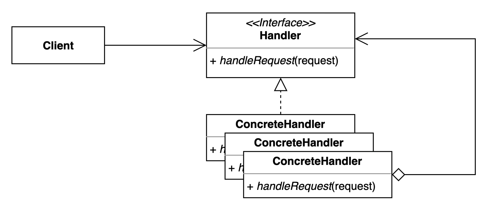

# 책임 연쇄 패턴

## 구성요소

- Client
- Handler
- ConcreteHandler

## 설명
요청을 보내는쪽과 요청을 처리하는쪽을 분리하는 패턴

- Handler
  - 요청을 처리하는 메서드를 정의하고 선택적으로 체인의 다음 처리기에 대한 참조를 제공하는 인터페이스 또는 추상 클래스
- ConcreteHandler
  - Handler 인터페이스의 구체적인 구현. 각 콘크리트 핸들러에는 특정 유형의 요청을 처리하는 로직이 있다. 또한 체인의 다음 핸들러에 대한 참조도 가지고 있다. 

패턴의 이점
- 발신자와 수신자 분리
  - 요청 발신자는 어떤 핸들러가 요청을 처리할지 알 필요가 없다. 체인의 첫 번째 핸들러만 알면 된다. 이 분리는 유연성과 유지 관리성을 향상시킨다.
- 동적 체인 수정
  - 클라이언트 코드에 영향을 주지 않고 런타임에 처리기를 동적으로 추가, 제거 또는 재구성할 수 있다.
- 확장성
  - 기존 코드를 수정하지 않고 다양한 유형의 요청을 처리하기 위해 체인에 새 처리기를 쉽게 추가할 수 있다.