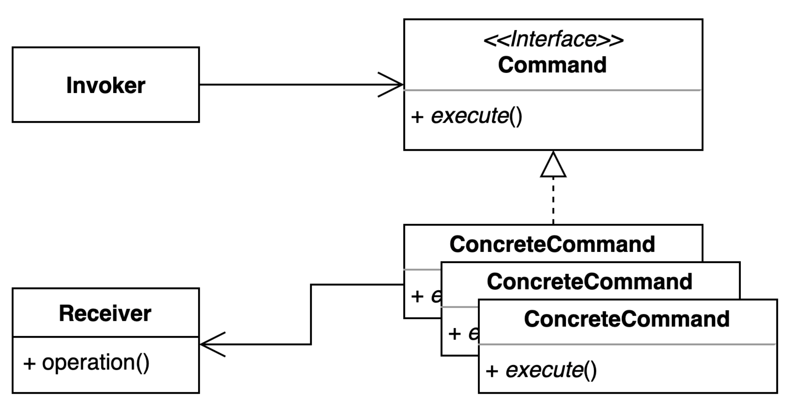

# 커맨드 패턴

## 구성요소

- Invoker
- Command
- ConcreteCommand
- Receiver

## 설명
실제 작업을 수행하는 개체에서 요청 발신자를 분리하는 동작 디자인 패턴

커맨드 패턴을 사용하면 중간 Command 개체를 도입하여 수신자(작업 수행하는 개체)에서 발신자(클라이언트)를 분리할 수 있다.
클라이언트는 특정 명령 개체를 만들고 해당 수신기를 설정한다. 클라이언트가 명령의 실행 메서드를 호출하면 수신기에서 적절한 작업의 실행을 간접적으로 트리거 한다.

**구성요소**
- Command
  - 명령을 실행하기 위한 메소드를 선언하는 인터페이스 또는 추상클래스
- ConcreateCommand
  - Command 인터페이스를 구현하는 클래스
  - 특정 작업을 캡슐화하고 실제 작업을 수행하는 수신기 개체에 대한 참조를 보유한다.
- Receiver
  - 명령과 관련된 실제 작업을 수행하는 개체
- Invoker
  - 명령 실행 담당. Command 개체에 대한 참조를 보유하고 실행 메서드를 호출한다. 