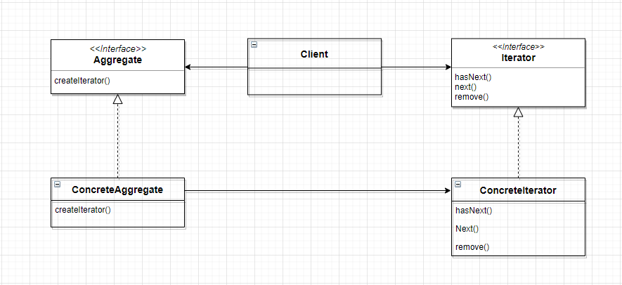

# 반복자 패턴

## 구성요소

- Iterator
- Aggregate

## 설명
Iterator 패턴은 기본 표현을 노출하지 않고 집계 개체의 요소에 순차적으로 액세스하는 방법을 제공하는
동작 디자인 패턴이다.

개체의 내부 구조를 노출하지 않고 표준화된 방식으로 컬렉션 또는 컨테이너 개체의 요소를 반복할 수 있다.

Iterator
- 컬렉션의 요소에 접근하고 순회하기 위한 인터페이스를 정의한다. 
- Next(), HasNext(), Current() 등의 메서드를 제공하하여
각각 다음 요소를 검색하고, 더 많은 요소가 있는지 확인하고, 현재 요소를 검색한다.

Aggregate
- Iterator가 통과할 컬렉션 또는 컨테이너 개체를 나타낸다. 일반적으로 CreateIterator()라는 이름의 메서드를 제공한다.
- 이 메서드는 해당 특정 컬렉션에 특정한 Iterator 객체를 생성하고 반환한다.