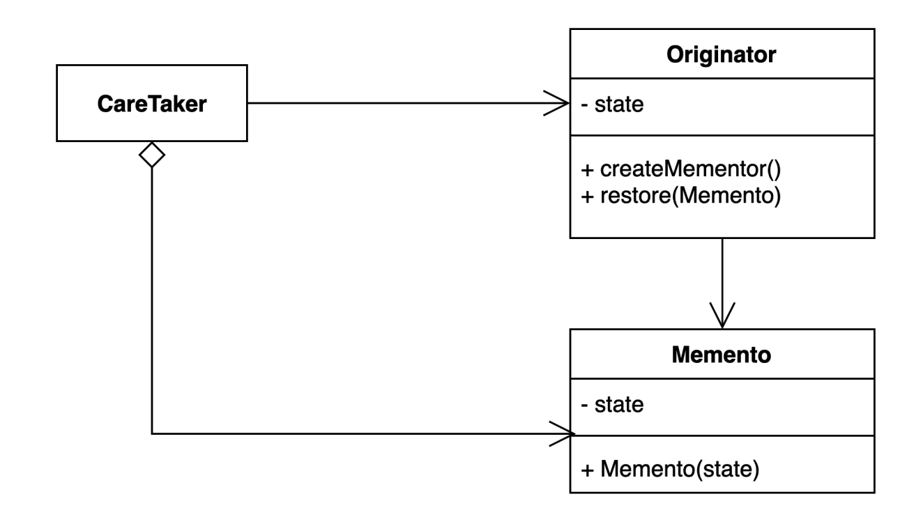

# 메멘토 패턴

## 구성요소

- Originator
- Memento
- CareTaker

## 설명
캡슐화를 유지하면서 객체 내부 상태를 외부에 캡쳐(저장)하는 패턴

객체 상태를 외부에 저장했다가 해당 상태로 다시 복구할 수 있다.
메멘토 패턴은 실행 취소, 임시저장 등 다양한 상황에 적용될 수 있다.
포인트는 메멘토에 저장된 값은 변경될 수 없어야 한다.
