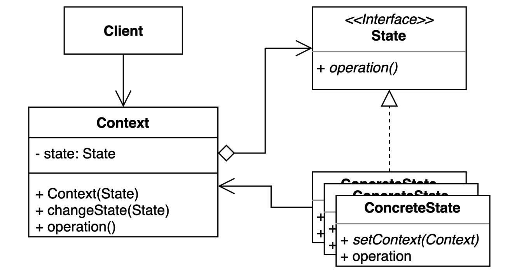

# 상태 패턴

## 구성요소

- Client
- Context
- State
- ConcreteState

## 설명
객체 내부 상태 변경에 따라 객체의 행동이 달라지는 패턴

상태에 특화된 행동들을 분리해 낼 수 있으며, 새로운 행동을 추가하더라도 다른 행동에 영향을 주지 않는다.

상태 패턴에서 중요한 점은 상태 객체가 직접 기능을 제공한다는 점이다.
따라서, 상태가 많아질수록 조건문을 이용한 방식은 코드가 복잡해져서 유지보수를 어렵게 만들지만,
상태 패턴의 경우 상태가 많아지더라도 코드의 복잡도는 증가하지 않기 때문에 유지보수에도 유리하다.
또한, 상태 별로 구현 코드가 분리되어 SRP도 자연스레 지켜진다.