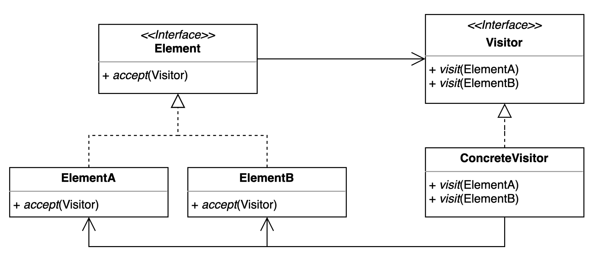

# 방문자 패턴

## 구성요소

- Visitor
- ConcreteVisitor
- Element
- ConcreteElement (ElementA, ElementB)

## 설명
객체 구조를 변경하지 않고 새로운 기능을 추가하기 위한 패턴

객체들의 구조와 동작을 분리시키는데 중점을 두며, 객체 구조 내의 각 요소에 대해 독립적으로 동작을 수행할 수 있도록 한다.
이는 개방-폐쇄 원칙(OCP, Open-Closed Principle)을 따르며, 코드의 재사용성과 확장성을 높일 수 있다.

구성요소
- Visitor
  - Visitor는 객체 구조 내의 각 요소에 대한 동작을 정의하는 인터페이스 또는 추상클래스이다.
  - 이 인터페이스는 객체 구조 내의 각 클래스에서 구체적으로 구현된다.
- ConcreteVisitor
  - ConcreteVisitor는 Visitor 인터페이스를 구현하는 실제 방문자 클래스이다. 
  - 이 클래스는 객체 구조 내의 각 클래스를 방문하고, 특정 동작을 수행한다.
- Element
  - Element는 Visitor를 받아들일 수 있는 인터페이스 또는 추상클래스이다. 
- ConcreteElement
  - ConcreteElement는 Element 인터페이스를 구현하는 실제 요소 클래스이다. 
  - 이 클래스는 Visitor를 받아들일 수 있고, 방문자로부터 호출된 동작을 수행한다.
