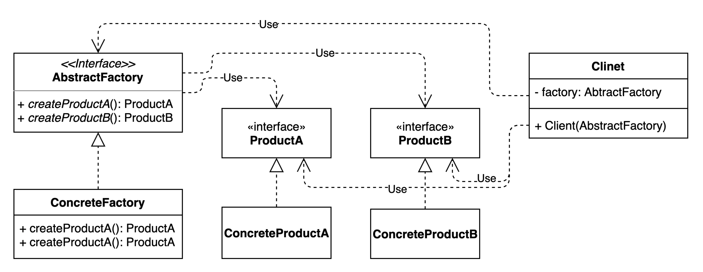

# 추상 팩토리 메소드 패턴

## 구성요소

- AbstractFactory
- ConcreteFactory
- ProductA
- ConcreteProductA
- ProductB
- ConcreteProductB

## 설명
추상 팩토리 메소드 패턴은 유연하고 확장 가능한 방식으로 관련 개체의 패밀리를 만드는 데 유용한 디자인 패턴입이다.

추상 팩토리 메서드 패턴은 몇 가지 주요 구성 요소로 구성된다.

1. 추상 팩토리 
   - 추상 제품 객체를 생성하기 위한 팩토리 메서드를 선언하는 인터페이스
2. 콘크리트 팩토리
   - 추상 팩토리 인터페이스의 구체적인 구현이다. 특정 제품군 또는 그룹에 속하는 구체적인 제품 객체를 생성한다.
3. 추상 제품
   - 모든 구체적인 제품 개체가 구현해야 하는 일련의 메서드를 선언하는 인터페이스
4. 구체적인 제품
   - 추상적인 제품 인터페이스의 구체적인 구현이다. 해당하는 콘크리트 팩토리에 의해 생성된 제품 개체의 동작을 정의한다.

추상 팩토리 메서드 패턴을 사용하면 구체적인 클래스를 지정하지 않고도 관련된 개체군을 만들 수 있다. 
이렇게 하면 기존 코드를 변경하지 않고도 한 객체 패밀리를 다른 패밀리로 교체하거나 새 객체 패밀리를 추가하기가 쉬워진다.
