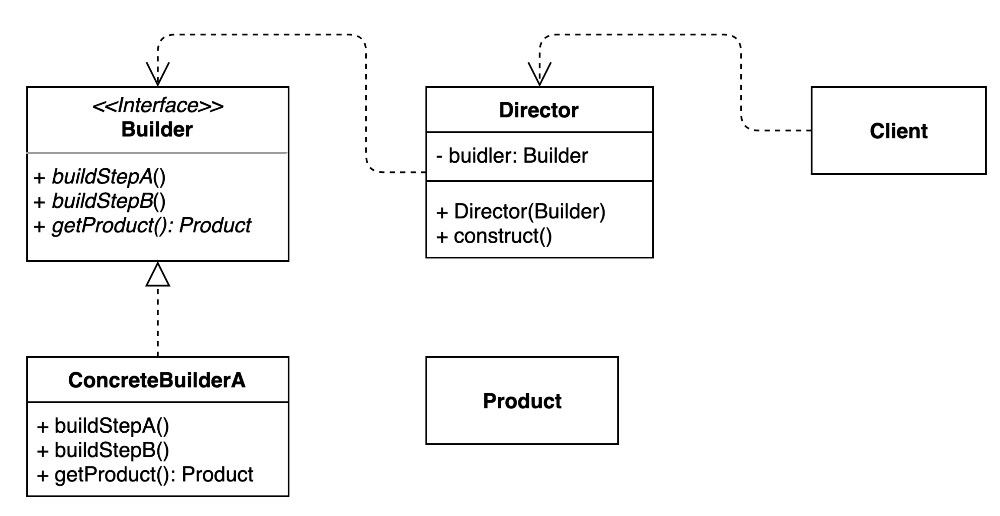

# 빌더 패턴

## 구성요소

- Builder
- Concrete Builder
- Product
- Director

## 설명
빌더 패턴은 복잡한 객체를 유연하고 단계별로 생성하는 데 유용한 디자인 패턴

빌더 패턴은 몇 가지 주요 구성 요소로 구성됩니다.
1. Builder
   - 생성되는 객체의 다른 부분을 생성하기 위한 일련의 메서드를 정의하는 인터페이스
2. Concrete Builder 
   - Builder 인터페이스의 구체적인 구현이다. 여기에는 개체의 각 부분을 구성하고 최종 개체를 조립하는 방법이 포함되어 있습니다.
3. Product
   - 일반적으로 많은 다른 부분으로 구성되는 최종 개체입니다.
4. Director
   - 올바른 순서로 Builder 인터페이스의 메서드를 호출하여 구성 프로세스를 제어하는 구성 요소이다.

빌더 패턴의 주요 이점 중 하나는 복잡한 개체의 생성을 해당 표현에서 분리할 수 있다는 것이다. 
이렇게 하면 개체의 표현이나 동작에 영향을 주지 않고 개체 구성 방식을 변경할 수 있으므로 시간이 지남에 따라 코드를 유지 관리하고 수정하기가 더 쉬워진다.

