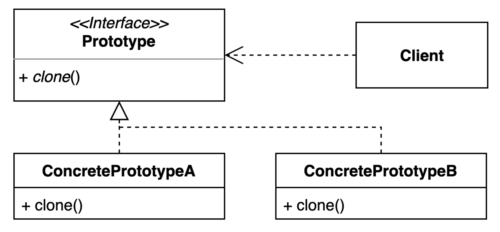

# 프로토타입 패턴

## 구성요소

- Client
- Prototype 
- ConcretePrototypeA
- ConcretePrototypeB

## 설명
프로토타입 패턴은 프로토타입 인스턴스를 기반으로 개체를 생성할 수 있는 생성 디자인 패턴 

처음부터 개체를 만드는 대신 프로토타입 패턴은 기존 인스턴스를 복사하거나 복제하여 개체를 만든다. 
이 패턴은 새 개체를 만드는 데 비용이 많이 들거나 시간이 오래 걸리는 경우 또는 특정 속성이나 동작이 있는 기존 개체를 기반으로 새 개체를 만들려는 경우에 유용하다. 
