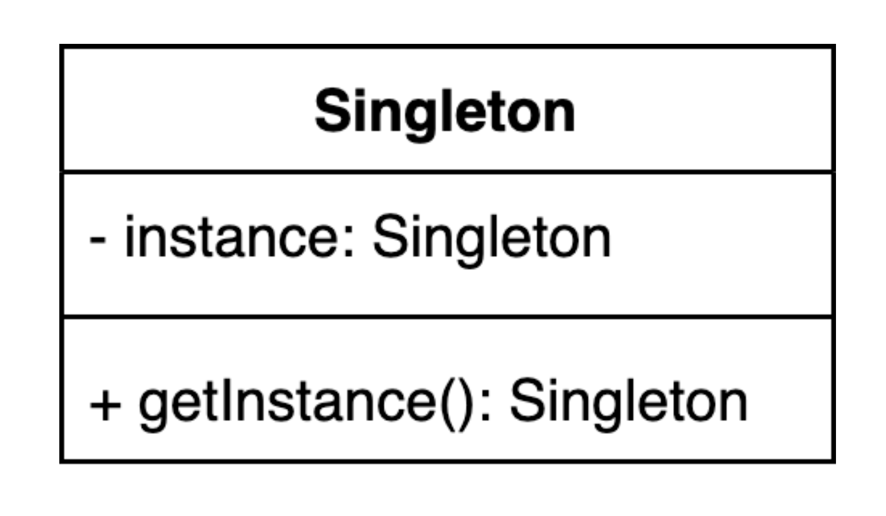

# 싱글톤 패턴

## 설명
애플리케이션 전체에서 클래스의 인스턴스가 하나만 존재하도록 하는 생성 패턴

클래스의 인스턴스화를 단일 개체로 제한하고 해당 인스턴스에 대한 전역 액세스를 제공한다.

특징
- 단일 인스턴스: 클래스의 인스턴스가 하나만 생성되고 응용 프로그램에 존재하도록 한다.
- 전역 액세스: 전역적으로 액세스할 수 있으므로 새 인스턴스를 만들지 않고도 코드의 다른 부분에서 액세스 할 수 있다.
- 초기화 지연: 인스턴스는 미리 생성되지 않고 처음 요청이 발생했을때 생성된다.

싱글톤 패턴은 클래스의 여러 인스턴스가 문제를 일으킬 수 있거나 불필요한 경우에 유용하다. 예를들어 로깅 서비스, 데이터베이스 연결 풀
또는 구성 관리자는 일반적으로 싱글톤으로 구현된다.

