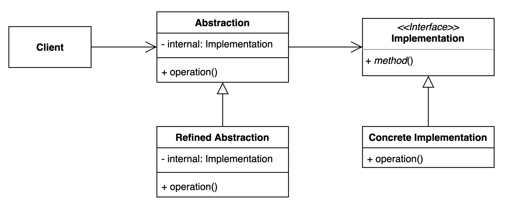

# 브릿지 패턴

## 구성요소

- Client
- Abstraction
- Refined Abstraction
- Implementation
- Concrete Implementation

## 설명
브릿지 패턴은 구현에서 추상화를 분리하여 독립적으로 변경할 수 있도록 하는 패턴

브릿지 패턴에는 추상화와 구현이라는 두 가지 주요 구성 요소가 포함된다. 

- 추상화
  - 클라이언트가 상호작용하는 상위 수준 인터페이스
- 구현
  - 하위 수준 구현 세부 정보

브릿지 패턴을 사용하면 추상화와 구현 사이에 브릿지를 생성하여 독립적으로 변경이 가능하다. 
이는 서로 영향을 주지 않고 추상화와 구현을 변경하거나 확장할 수 있음을 나타낸다.

일반적으로 추상화 인터페이스와 추상화 및 구현을 위한 별도의 구체적인 클래스를 정의한다. 
추상화 인터페이스에는 상위 수준 작업을 정의하는 메서드가 포함되며 구체적인 클래스는 특정 구현 세부 정보를 제공한다.

일반적으로 여러 차원의 변동성이 있고 클래스 조합 폭발을 피하려는 상황에서 사용된다.