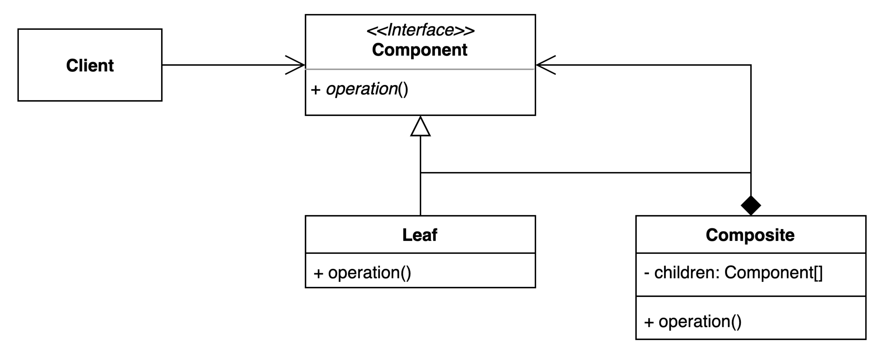

# 컴포짓 패턴

## 구성요소

- Client
- Component
- Leaf
- Composite

## 설명
컴포짓 패턴은 개체 그룹을 단일 개체로 처리할 수 있는 구조적 디자인 패턴

컴포짓 패턴에는 리프 노드와 복합 노드의 두 가지 유형의 객체가 있다. 
**리프 노드는 개별 개체**를 나타내고 **복합 노드는 개체 그룹**을 나타낸다. 
두 유형의 노드 모두 공통 인터페이스를 구현하여 균일하게 처리할 수 있다.

컴포짓 패턴의 핵심 아이디어는 복합 객체를 하위 객체의 모음으로 취급할 수 있다는 점이다. 
이는 개별 개체에서 수행할 수 있는 작업을 복합 개체에서도 수행할 수 있다. 