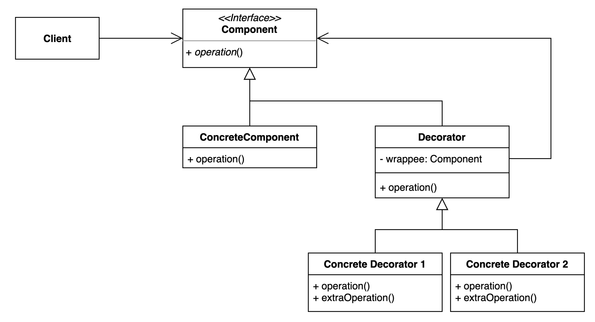

# 데코레이터 패턴

## 구성요소

- Client
- Component
- ConcreteComponent
- Decorator
- Concrete Decorator

## 설명
기존 코드를 수정하지 않고 부가 기능을 추가하는 패턴

데코레이터 패턴은 위임을 통해 기능을 확장해 나간다.
따라서, 데코레이터를 조합하는 방식으로 기능 확장이 가능하다. 또한 기능 적용 순서도 손쉽게 변경 가능하다.