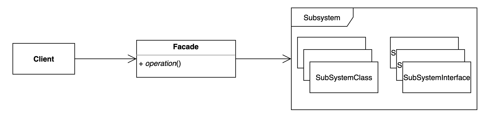

# 퍼사드 패턴

## 설명
Facade 패턴은 클라이언트가 단순화된 방식으로 시스템과 상호 작용할 수 있도록 복잡한 시스템에 간단한 인터페이스를 제공하는 패턴이다. 

Facade는 시스템의 "정문" 역할을 하여 클라이언트를 복잡성과 내부 작업으로부터 보호한다.

Facade 패턴은 복잡한 시스템과의 상호 작용을 단순화하여 결합을 줄일 수 있다. 상호 의존적인 구성 요소가 많은 시스템으로 작업하거나 이해하거나 수정하기 어려운 코드를 처리할 때 고려해야 할 유용한 패턴이다.