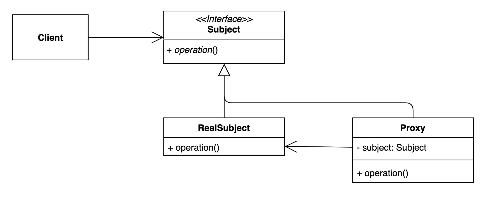

# 프록시 패턴

## 구성요소

- Client
- Subject
- RealSubject
- Proxy

## 설명
특정 객체에 대한 접근을 제어하거나 기능을 추가할 수 있는 패턴

접근 제어, 로깅, 캐싱 등에 사용 가능하다.

프록시 패턴과 데코레이터 패턴의 구현방식이 유사하지만 의도는 명확히 차이를 보인다. 프록시 패턴의 경우는 실제 객체에 대한 접근을 제어하는데 초점이 맞춰져 있다면
데코레이터 패턴은 기존 객체의 기능을 확장하는데 초점을 맞추고 있다. 
